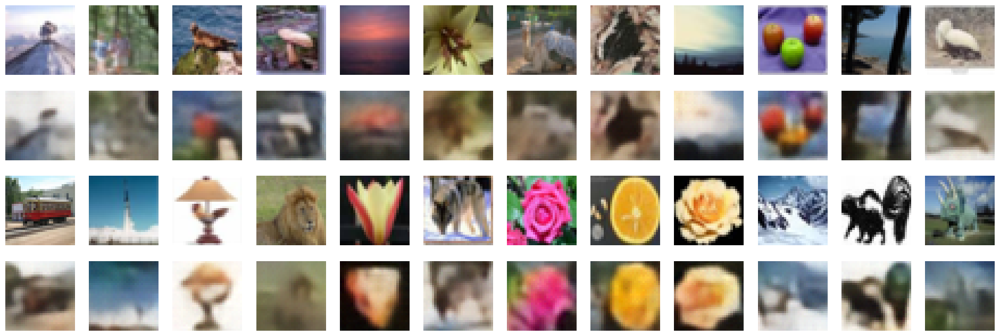

# VQ-VAE

[VQ-VAE](https://arxiv.org/pdf/1711.00937) PyTorch implementation. Trained on Cifar100 dataset.

## Usage
1. Run `train_ae.ipynb` to train the model. The notebook is designed to be run on Google Colab. `model.py` contains the model architecture.
2. Take the model and run `regenerate_images.ipynb` to regenerate images.

## Results
The top row is the original image and the bottom row is the regenerated image.

